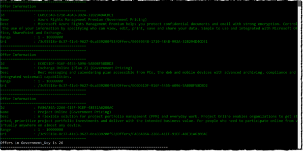
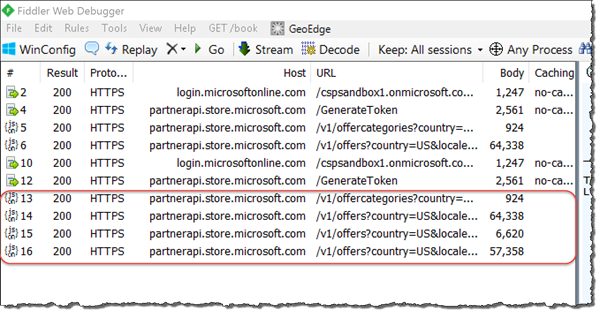
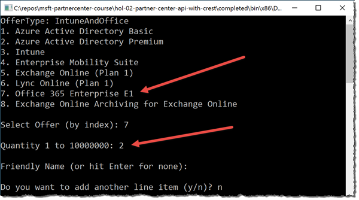
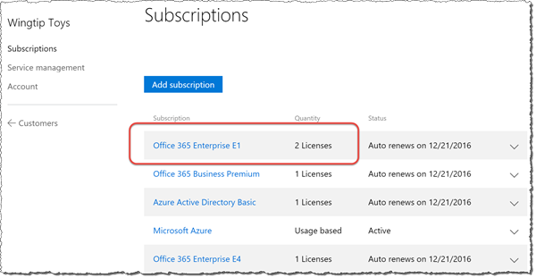

# Using the Partner Center SDK with an existing CREST API Based Application

The Partner Center SDK provides a superset of the prior CREST API functionality and enables partners to connect their sales and billing systems to Microsoft for the purposes of selling Microsoft Commercial Cloud software. This Visual Studio based lab starts with one of the existing samples for working with the CREST API and takes you through adding functionality to look up the list of offers available for sale with the Partner Center SDK. Some experience with Visual Studio and C# is required.


## Prerequisites

*Refer to the [Hands-On Lab Prerequisites](../hol-prereqs.md) for a full list of all prerequisites, additional details and additional resources.*

- Have access to the [Partner Center](https://partnercenter.microsoft.com) website & your partner ID.
- Have the login information for your CSP Integration Sandbox account.
- Developer environment with Visual Studio 2015 installed & configured.


## Exercise 1: Acquire, Configure & Test Existing CREST API Application

In this exercise you will take an existing .NET application written to use the CREST API and configure it to work with your partner account.

### Collect Necessary Details from the Integration Sandbox in the Partner Center
In order to configure the sample project, you need to first collect some details from Azure AD.

1. Within a browser, navigate to the Partner Center: https://partnercenter.microsoft.com.
1. Click the **Sign in** link in the upper right corner & login using your Integration Sandbox account credentials.
1. Under the section **Profile Management**, select the **View your organization profile** link.
  1. Copy the **Microsoft ID** GUID down for later use. This will be referred to as the *Partner's Microsoft ID* later.
  1. Copy the **Default Domain** down for later use.
1. Locate the **Account Settings** menu item in the left-hand navigation.
  1. Select the **API** menu item in the left-hand navigation.
  1. Copy the **App ID** GUID down for later use.
  1. Under the **Key Management** section you need to create a new key for use in the sample application. 
  
    > While you may already have a key previously created, you cannot retrieve the values of previously created keys for security reasons. However you can create as many keys as you like so creating another one is not a problem.
    
    1. Select a key duration of either **1 year** or **2 years** and click the **Add** button. When the page refreshes, copy it down for later use.
1. Select the **Dashboard** link in the upper right-hand corner of the page.
1. Select the **Customers** menu item in the left-hand navigation.
  1. Click the chevron (down arrow) on the right-hand side of a customer you are interested in querying. 
  1. Copy the **Microsoft ID** GUID down for later use. This will be referred to as the *Customer's Microsoft ID* later.


### Configure the Sample Project

1. Launch **Visual Studio 2015**.
1. Open the sample project:
  1. Visual Studio 2015: **File** :arrow_right: **Open** :arrow_right: **Project/Solution**.
  1. Select the Visual Studio solution file `Microsoft.Partner.CSP.Api.Samples.sln` found in this lab's [starter](starter) folder & click the **Open** button.

    > **Note**: This sample project is a copy from a specific point in time of another public sample provided by the Partner Center team. You can learn more about it by exploring the [starter/README.md](starter/README.md) file.
  
1. Update the sample project's configuration settings:
  1. Open the `App.config` file.
  1. Update the application setting **AppId** to the value of the *app ID* you copied from the Partner Center above.
  1. Update the application setting **key** to the value of the key you created above.
  1. Update the application setting **MicrosoftId** to the value of the *Partner's Microsoft ID* you copied from the Partner Center above.
  1. Update the application setting **DefaultDomain** to the value you copied from the Partner Center above.
  1. Update the application setting **ExistingCustomerMicrosoftId** to the value of the *Customer's Microsoft ID* you copied from the Partner Center above.
1. Verify the `System.Web.Helpers` is present.
  1. Within the **Solution Explorer**, expand the **References** node. If the `System.Web.Helpers` assembly is not showing a yellow error icon, everything is fine and you can skip the next ******* steps. However if a yellow warning icon is showing next to it, continue to the next step.
  1. Right-click the project within the **Solution Explorer** and select **Manage NuGet Packages...**.
    1. Find and install the following package:
      - Microsoft.AspNet.WebHelpers
1. Test the application to verify everything has been configured correctly:
  1. Before starting the application, launch [Fiddler](http://www.telerik.com/fiddler), an HTTP debugging proxy, to see the actual calls the application is making to the CREST API. This will allow you to verify the sample application can successfully authenticate to Azure AD the CREST API.
  1. Save your changes and press **F5** to test the application.
  1. The application will start and first ask to confirm that the `App.config` file has been updated. Press `Y` and `[ENTER]` to continue. The application will then go through a series of round trips to Azure AD and the CREST API to authenticate and obtain OAuth2 access tokens. 
  1. Switch over to Fiddler to see the the results of these authentication requests. Notice how every request results in an HTTP status 200. This means that the app is configured correctly as the status code of 200 indicates success. Selecting a session and inspecting the response will yield the actual access tokens returned by the service.

    

1. The sample application will add orders to the specified customer so instead of doing that, within Visual Studio, stop debugging to terminate the application.

Congratulations! In this exercise you took an existing .NET application written to use the CREST API and configured it to work with your partner account.


## Exercise 2: Use Partner Center REST API to list Office 365 Offers

In this exercise you will take the .NET application you configured in the previous exercise in this hands-on-lab and update it to list all Office 365 offers using the Partner Center REST API.

1. Open the sample project **Microsoft.Partner.CSP.Api.Samples** if it is not already open in Visual Studio 2015. *This is the same project from the previous lab exercise above.*

> The CREST API does not expose a way to query for Office 365 Offers available to a customer. Rather offers must be hard-coded within a custom application. This is demonstrated in the sample application within the code file `OfferCatalog.cs`. Notice starting around line 25 the application contains a hard-coded collection of offers.

Change the sample application from using a hard-coded list of offers to instead use a dynamic list by using the Partner Center REST API.

1. First, because the code will call a REST API and get a response in JSON format, add a library to make it easier to work with JSON data in C#:
  1. Within the **Solution Explorer** tool window, right-click the project and select **Manage NuGet Packages..**
  1. Find and install the following package:
    - Newtonsoft.Json *v8.0.1*
1. Add a new `OfferCatalog.cs` class to the project:
  1. Within the **Solution Explorer** tool window, right-click the project and select **Add** :arrow_right: **Class**.
  1. Name the class `OfferCatalogPartnerCenterApi.cs` and click **Add**.
1. Within the `OfferCatalogPartnerCenterApi.cs` file, add the following `using` statements to the top of the file:

  ```c#
  using System.Configuration;
  using System.IO;
  using System.Net;
  using Newtonsoft.Json;
  ```

1. Now, within the `OfferCatalogPartnerCenterApi` class, create a method that will retrieve all the offer categories for a specified country code & locale:
  1. Add a new method that returns a dynamic value:

    ```c#
    public static dynamic GetOfferCategories(string countryCode, string token){
    }
    ```
  
  1. Within this method, create a variable to hold Partner Center REST API endpoint to call to retrieve all the offer categories:

    ```c#
    // create endpoint to the Partner Center REST API
    var endpoint = string.Format("{0}/v1/offercategories?country={1}&locale={2}",
                                  ConfigurationManager.AppSettings["PartnerCenterApiEndpoint"],
                                  countryCode);
    ```

  1. Next, create the HTTP request object and configure the HTTP method type as well as all the necessary request headers, including the authorization header that will include the OAuth2 access token:

    ```c#
    // create request with common headers
    var request = (HttpWebRequest)HttpWebRequest.Create(endpoint);
    request.Method = "GET";
    request.Accept = "application/json";
    
    // set HTTP request headers
    request.Headers.Add("MS-Contract-Version", "v1");
    request.Headers.Add("X-Locale", "en-US");
    request.Headers.Add("MS-CorrelationId", Guid.NewGuid().ToString());
    request.Headers.Add("MS-RequestId", Guid.NewGuid().ToString());
    
    // set the authorization header to include the oauth2 access token
    request.Headers.Add("Authorization", "Bearer " + token);
    ```

  1. Add a `try-catch` block to issue the request, parse & print the response to the console and return the collection of offer categories to the caller:

    ```c#
    try {
      Utilities.PrintWebRequest(request, string.Empty);
    
      // issue request
      var response = request.GetResponse();
      using (var reader = new StreamReader(response.GetResponseStream())) {
        var responseContent = reader.ReadToEnd();
        Utilities.PrintWebResponse((HttpWebResponse)response, responseContent);
    
        // convert response to strongly typed [dynamic] object
        var offerCategoriesResponse = JsonConvert.DeserializeObject<dynamic>(responseContent);
    
        // loop through each category and write to to the console
        foreach (var offerCategory in offerCategoriesResponse.items) {
          PrintOfferCategory(offerCategory);
        }
    
        // return all categories to caller
        return offerCategoriesResponse;
      }
    } catch (WebException webException) {
      using (var reader = new StreamReader(webException.Response.GetResponseStream())) {
        var responseContent = reader.ReadToEnd();
        Utilities.PrintErrorResponse((HttpWebResponse)webException.Response, responseContent);
      }
    }
    return string.Empty;
    ```
1. Next, within the `OfferCatalogPartnerCenterApi` class, create a method that will retrieve all the offers for a specified category, country code & locale:
  1. Add a new method that returns a dynamic value:

    ```c#
    public static dynamic GetOffers(string offerCategoryId, 
                                    string countryCode,
                                    string token) {
    }
    ```

  1. Within this method, create a variable to hold the Partner Center API endpoint to call that returns all offers:

    ```c#
    // create endpoint to the Partner Center REST API
    var endpoint = string.Format("{0}/v1/offers?country={1}&offer_category_id={2}", 
                                 ConfigurationManager.AppSettings["PartnerCenterApiEndpoint"], 
                                 countryCode,
                                 offerCategoryId);
    ```

  1. Next, create the HTTP request object & configure the HTTP method type as well as the required request headers, including the authorization header that will include the OAuth2 access token:

    ```c#
    // create request with common headers
    var request = (HttpWebRequest)HttpWebRequest.Create(endpoint);
    request.Method = "GET";
    request.Accept = "application/json";
  
    // set HTTP request headers
    request.Headers.Add("X-Locale", "en-US");
    request.Headers.Add("MS-Contract-Version", "v1");
    request.Headers.Add("MS-CorrelationId", Guid.NewGuid().ToString());
    request.Headers.Add("MS-RequestId", Guid.NewGuid().ToString());
  
    // set the authorization header to include the oauth2 access token
    request.Headers.Add("Authorization", "Bearer " + token);
    ```

  1. Add a `try-catch` block to issue the request, parse & print the response to the console and return the collection of offers to the caller:

    ```c#
    try {
      Utilities.PrintWebRequest(request, string.Empty);
    
      // issue request
      var response = request.GetResponse();
      using (var reader = new StreamReader(response.GetResponseStream())) {
        var responseContent = reader.ReadToEnd();
        Utilities.PrintWebResponse((HttpWebResponse)response, responseContent);
    
        // convert response to strongly typed [dynamic] object
        var offerResponse = JsonConvert.DeserializeObject<dynamic>(responseContent);
    
        // loop through each category and write to the console
        foreach (var offer in offerResponse.items) {
          PrintOffer(offer);
        }
    
        // return all offers to caller
        return offerResponse;
      }
    } catch (WebException webException) {
      using (var reader = new StreamReader(webException.Response.GetResponseStream())) {
        var responseContent = reader.ReadToEnd();
        Utilities.PrintErrorResponse((HttpWebResponse)webException.Response, responseContent);
      }
    }
    return string.Empty;
    ```

1. Finally add two more methods that are called by the two methods added above that will print the offer categories and offers to the console:

  ```c#
  public static void PrintOfferCategory(dynamic offerCategory) {
    Console.ForegroundColor = ConsoleColor.DarkGreen;
    Console.WriteLine("=========================================");
    Console.WriteLine("Offer Category Information");
    Console.WriteLine("=========================================");
    Console.WriteLine("Id\t\t: {0}", offerCategory.id);
    Console.WriteLine("Category\t: {0}", offerCategory.name);
    Console.WriteLine("Rank\t\t: {0}", offerCategory.rank);
  
    Console.WriteLine("=========================================");
    Console.ResetColor();
  }
  
  public static void PrintOffer(dynamic offer) {
    Console.ForegroundColor = ConsoleColor.DarkGreen;
    Console.WriteLine("=========================================");
    Console.WriteLine("Offer Information");
    Console.WriteLine("=========================================");
    Console.WriteLine("Id\t\t: {0}", offer.id);
    Console.WriteLine("Name\t\t: {0}", offer.name);
    Console.WriteLine("Desc\t\t: {0}", offer.description);
    Console.WriteLine("Range\t\t: {0} - {1}", offer.minimumQuantity, offer.maximumQuantity);
    Console.WriteLine("Uri\t\t: {0}", offer.uri);
  
    Console.WriteLine("=========================================");
    Console.ResetColor();
  }
  ```

The existing application leverages the CREST API which uses Azure AD access tokens and sales agent tokens. In order to use the Partner Center API, you need to obtain a token for Partner Center.

1. Open the `Reseller.cs` class.
1. Add the following `using` statements just after the existing statements in the file:

  ```c#
  using System.Configuration;
  using Newtonsoft.Json;
  ```

1. Next, add a new method that will be called to obtain an access token for the Partner Center API:
  1. Add the following method to the `Reseller` class:

    ```c#
    private static dynamic GetPartnerCenterApi_Token(string adToken, string clientId) {
    }
    ```

  1. Within this method, create a variable to hold the Partner Center API endpoint to call that returns all offers:

    ```c#
    // create endpoint to the Partner Center REST API to get a token
    var endpoint = string.Format("{0}/GenerateToken", ConfigurationManager.AppSettings["PartnerCenterApiEndpoint"]);
    ```

  1. Next, create the HTTP request object & configure the HTTP method type as well as the required request headers, including the authorization header that will include the OAuth2 access token:

    ```c#
    // create request with common headers
    var request = (HttpWebRequest)WebRequest.Create(endpoint);
    request.Method = "POST";
    request.ContentType = "application/x-www-form-urlencoded";
    request.Accept = "application/json";
    
    // set HTTP request headers
    request.Headers.Add("X-Locale", "en-US");
    request.Headers.Add("MS-Contract-Version", "v1");
    request.Headers.Add("MS-CorrelationId", Guid.NewGuid().ToString());
    request.Headers.Add("MS-RequestId", Guid.NewGuid().ToString());
    
    // set the authorization header to include the oauth2 access token
    request.Headers.Add("Authorization", "Bearer " + adToken);
    
    // create the payload for the request
    string content = string.Format("grant_type=jwt_token&client_id={0}", clientId);
    using (var writer = new StreamWriter(request.GetRequestStream())) {
      writer.Write(content);
    }
    ```

  1. Add a `try-catch` block to issue the request, parse & print the response to the console and return the token to the caller:

    ```c#
    try {
      Utilities.PrintWebRequest(request, content);
    
      // issue request
      var response = request.GetResponse();
      using (var reader = new StreamReader(response.GetResponseStream())) {
        var responseContent = reader.ReadToEnd();
        Utilities.PrintWebResponse((HttpWebResponse)response, responseContent);
    
        // convert response to strongly typed [dynamic] object
        return JsonConvert.DeserializeObject<dynamic>(responseContent);
      }
    } catch (WebException webException) {
      using (var reader = new StreamReader(webException.Response.GetResponseStream())) {
        var responseContent = reader.ReadToEnd();
        Utilities.PrintErrorResponse((HttpWebResponse)webException.Response, responseContent);
      }
    }
    return string.Empty;
    ```

  1. Finally, add the following method that will act as a wrapper to determine if the token is invalid or near expiration and if so, obtain a new token:

    ```c#
    public static AuthorizationToken GetPartnerCenterApi_Token(AuthorizationToken adAuthorizationToken, 
                                              string clientId, 
                                              AuthorizationToken partnerCenterApiAuthorizationToken = null) {
      if (partnerCenterApiAuthorizationToken == null || 
          (partnerCenterApiAuthorizationToken != null && partnerCenterApiAuthorizationToken.IsNearExpiry())
         ) {
        //// Refresh the token on one of two conditions
        //// 1. If the token has never been retrieved
        //// 2. If the token is near expiry
    
        var partnerCenterApiToken = GetPartnerCenterApi_Token(adAuthorizationToken.AccessToken, clientId);
        var accessToken = partnerCenterApiToken.access_token.ToString();
        var expiresInOffset = Convert.ToInt64(partnerCenterApiToken.expires_in);
        partnerCenterApiAuthorizationToken = new AuthorizationToken(accessToken, expiresInOffset);
      }
    
      return partnerCenterApiAuthorizationToken;
    }
    ```

1. Now the Partner Center API can be called to list all offer categories and offers.
  1. Open the `Program.cs` file.
  1. Within the `Program` class, locate where the private static variables are defined. Add the following variable to store the token for the Partner Center API:
  
    ```c#
    private static AuthorizationToken partnerCenterApiAuthorizationToken { get; set; }
    ```

  1. Next, within `Main()`, locate the `try-catch` block. The first line within the `try-catch` obtains a token from Azure AD.
  
    Add the following code to use the Azure AD token to obtain a token for the Partner Center REST API:

    ```c#
    // Get Partner Center API access token
    partnerCenterApiAuthorizationToken = Reseller.GetPartnerCenterApi_Token(adAuthorizationToken, appId);
    ```

  1. Then add the following code to get a list of all offer categories, followed by all offers within each category and finally write the number of offers within each category to the console:

    ```c#
    // get all offer categories
    var offerCategoriesResponse = OfferCatalogPartnerCenterApi.GetOfferCategories("US", "en-US", partnerCenterApiAuthorizationToken.AccessToken);
    
    // write the number of offers in each category out to the console
    foreach (var offerCategory in offerCategoriesResponse.items) {
      var offersResponse = OfferCatalogPartnerCenterApi.GetOffers(offerCategory.category.ToString(), 
                                                                  "US", 
                                                                  partnerCenterApiAuthorizationToken.AccessToken);
      Console.WriteLine("Offers in {0} is {1}", offerCategory.category.ToString(), offersResponse.totalCount);
    }
    ```

  1. Finally, add `Console.ReadLine();` right after the `foreach` loop in the last statement to block the sample application from continuing.

1. Test the application to verify everything that has been added:
  1. Before starting the application, launch [Fiddler](http://www.telerik.com/fiddler).
  1. Save your changes and press **F5** to test the application.
  1. The application will start and first ask to confirm that the `App.config` file has been updated. Press `Y` and `[ENTER]` to continue. The application will then go through a series of roundtrips to Azure AD and the CREST API to authenticate and obtain OAuth2 access tokens. It will then display a list of all offer categories and then all offers within each category.

    

  1. Switch over to Fiddler to see the the results of these authentication requests. Notice after all the requests for tokens it makes a call to get all offer categories and then offers within each of the three (3) categories it retrieved:

    


Congratulations! In this exercise you took the .NET application you configured in the previous exercise in this hands-on-lab and updated it to list all Office 365 offers using the Partner Center REST API.


## Exercise 3: Use Partner Center SDK to Increase Office 365 Seat Counts

In this exercise you will take the .NET application you configured in the previous exercises in this hands-on-lab and update it to increase the number of seats for a customer’s Office 365 subscription using the Partner Center SDK.

1. Open the sample project **Microsoft.Partner.CSP.Api.Samples** if it is not already open in Visual Studio 2015. *This is the same project from the previous lab exercise above.*
1. Update the `App.config` file to add a setting for the Parter Center API endpoint:
  1. Open the `App.config` file.
  1. Add a new application setting as follows:

    ```xml
    <add key="PartnerCenterApiEndpoint" 
        value="https://api.partnercenter.microsoft.com" / 
    ```

1. Update the `Order` class to include new methods that use the Partner Center REST API:
  1. Open the `Order.cs` file.
  1. Jump to the end of the `Order` class.
  1. Add a new method that will prompt the user to enter an order in the console:

    ```c#
    public static dynamic PopulateOrderFromConsole(string customerCid,
                                                   string countryCode,
                                                   string token) {
    }
    ```

  1. Next, add the following code to the `PopulateOrderFromConsole()` method to list and prompt the user for a offer category to display:

    ```c#
    bool InvalidInput = false;
    var offerCategoriesResponse = OfferCatalogPartnerCenterApi.GetOfferCategories(countryCode, token);
    Console.WriteLine("Hit enter to continue");
    Console.ReadLine();

    Console.Clear();
    Console.WriteLine("Select Offer Category");
    ```

  1. Add the following `do-while` loop to list all offer categories. The user will enter a offer category to display which 

    ```c#
    do {
      int index = 1;
      foreach (var offerCategory in offerCategoriesResponse.items) {
        Console.WriteLine("{0} {1}", index++, offerCategory.category.ToString());
      }
    
      Console.Write("Enter index [1...{0}]:", index - 1);
      int input = Convert.ToInt32(Console.ReadLine().Trim());
    
      if (input <= index) {
        InvalidInput = true;
        // TODO >>> ADD CODE HERE
      }
    }
    while (!InvalidInput);
    
    return null;
    ```

  1. Now the `Order` class needs a method that will display all offers in the specific category and prompt the user to select an offer and quantity to add to the order line items. 
  
    This method, `PopulateOrderFromConsoleForOfferCategory()`, is quite long so it has been provided in full within the following file: [PopulateOrderFromConsoleForOfferCategory.txt](starter/PopulateOrderFromConsoleForOfferCategory.txt)

  1. The last step is to update the `PopulateOrderFromConsole()` method to call ` PopulateOrderFromConsoleForOfferCategory()`. 
  
    Locate the line `// TODO >>> ADD CODE HERE` and replace it with the following code:

    ```c#
    var offerCategoryResponse = offerCategoriesResponse.items[input - 1].id.ToString();
    return PopulateOrderFromConsoleForOfferCategory(offerCategoryResponse, 
                                                    customerCid, 
                                                    countryCode, 
                                                    token);
    ```

  1. Save the changes to the `Order.cs` file.
1. Update the console application to call the new methods that will use the changes made to the `Order` class:
  1. Open the `Program.cs` file.
  1. Locate the following line within the `Main()` method (*it should be on or near line 121*):

    ```c#
    var existingCustomerOrder = Order.PopulateOrderFromConsole(existingCustomerCid);
    ```
  
  1. Change the call for the method to be the following:

    ```c#
    var existingCustomerOrder = Order.PopulateOrderFromConsole(existingCustomerCid,
                                                               "US",
                                                               partnerCenterApiAuthorizationToken.AccessToken);
    ```

1. Test the application to verify everything that has been added:
  1. Before starting the application, launch [Fiddler](http://www.telerik.com/fiddler).
  1. Save your changes and press **F5** to test the application.
  1. After a moment the application will prompt to select a type of offer to display. Then it will prompt for a offer category to display Finally, it will prompt the user for a list of offers accepting a selection and quantity to enter:

    

    Once no more line items are added, the console application will submit the order for additional offers for the customer. Verify it was successful by inspecting the Fiddler trace as well as the customer's subscriptions in the Partner Center website:

    

Congratulations! In this exercise you took the .NET application you configured in the previous exercises in this hands-on-lab and updated it to increase the number of seats for a customer’s Office 365 subscription using the Partner Center SDK.
